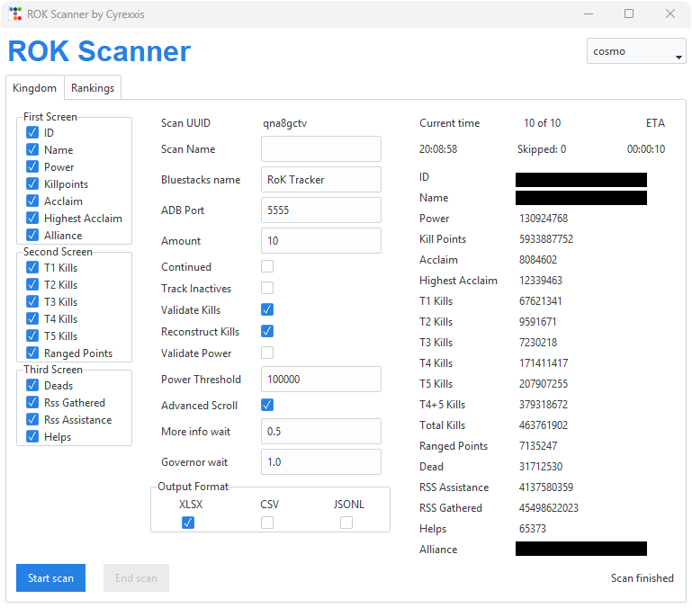
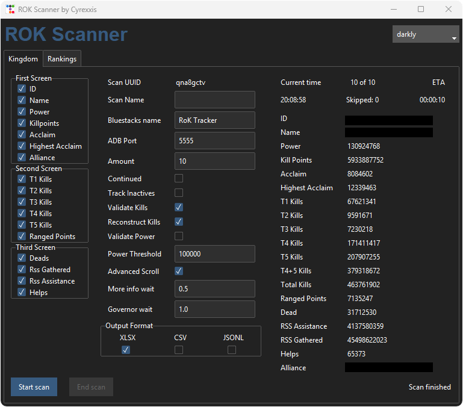

# Rok Tracker

## Summary

Open Source Rise of Kingdoms Stats Management Tool for the **PC client** (the scanner reads the game window and clicks with the mouse, no emulator needed). Track TOP X players in the kingdom leaderboard.

**Kingdom rankings:** Governor ID, Governor Name, Power, Kill Points, Ranged Points, T1-T5 Kills, Total Kills, T4+T5 Kills, Dead Troops, RSS Gathered, RSS Assistance, Helps and Alliance name.

This is a heavily modified version of the original tool from [nikolakis1919](https://github.com/nikolakis1919/RokTracker).

There are two ways of using the scanner:
- **Simple installation** — download the released `.exe`, no Python required. [Instructions below](#simple-installation).
- **Advanced installation** — clone the source and run with Python. [Instructions below](#advanced-installation).

## Breaking Changes (v6)

- **Config restructured:** The single `config.json` has been replaced with a `config/` folder containing multiple files for global settings, scanner presets, and GUI config. Version 5 configs are not compatible.
- **Unified scanner:** The individual scanner entry points have been merged into a single `scanner_console.py` and `scanner_ui.py`.

## Latest Changes

- Unified scanner
- More config options
  - Options per scan type
  - UI positions no longer hard coded → now in `config/internal/*.json`
- Support for Acclaim
- New GUI with theme support

---

## Screenshots

<details>

<summary>Click to expand</summary>

| Light Theme | Dark Theme |
|-------------|------------|
|  |  |

</details>

---

## Installation

**Prerequisites:** Rise of Kingdoms PC client, Python 3.14+ ([download](https://www.python.org/downloads/)) or uv ([instructions](https://docs.astral.sh/uv/)), [tessdata](https://github.com/tesseract-ocr/tessdata). On Windows, [Build Tools for C++](https://visualstudio.microsoft.com/de/visual-cpp-build-tools/) may be required. Here is how to set it up with uv:

1. Place tessdata into `deps/tessdata/` and the two copy-name icon pictures `copy_icon.png` and `copy_icon_white.png` into `assets/` (see [Folder Structure](#folder-structure))
2. Set up the game window — [see below](#game-window-setup)
3. Install dependencies: `uv sync`
4. Run the scanner:
   - `uv run scanner_console.py` — CLI
   - `uv run scanner_ui.py` — GUI

---

## Config Files

The `config/` folder contains these files:

| File | Purpose |
|------|---------|
| `config.json` | Global settings (game window title, wait timings) |
| `kingdom_defaults.json` | Default options for kingdom scans |
| `gui_config.json` | GUI settings (default theme) |

---

## Folder Structure

Only these directories need manual attention:

```
deps/
└── tessdata/
assets/
├── copy_icon.png
└── copy_icon_white.png
```

Everything else (`config/`, `_internal/`, source scripts) is either downloaded from the release or generated automatically. Scan results go into `scans_kingdom/`. Intermediate screenshots go into `temp_images/`.

---

## Features

### Kingdom Scanner

- Full kingdom ranking scan (all governors)
- Wrong kill detection: validates that kills match kill points; suspicious items are saved to `manual_review/` with `F` prefix and a warning is logged
- Kill reconstruction: option to try recovering wrong kill values; reconstructed items get `R` prefix in `manual_review/`
- Inactive account detection: accounts that can't be clicked are skipped automatically; screenshots can optionally be saved to `inactives/`
- Stats to scan can be selected (if only stats from 1st page are use 2nd and 3rd page will get skipped to make the scan faster)

---

## Game Window Setup

- Run the game in **windowed mode** and keep the whole window visible on screen (not minimized, not covered by other windows) while scanning — the scanner takes screenshots of the screen area of the game.
- Use a **16:9 client area** (e.g. 1600x900). All positions in `config/internal/kingdom.json` are written for 1600x900; other 16:9 sizes are scaled automatically.
- The window title defaults to `Rise of Kingdoms` (partial matches work). Change it in the app or in `config/config.json` (`general.window_title`).
- **Press F10 at any time to abort a running scan immediately** — the mouse is controlled by the scanner, so this is the quickest way out. Progress so far is saved. The GUI's stop button finishes the current governor first.

---

## Important Notes

### Scan Preparation

- Your active character must be in **Home Kingdom** to scan only your kingdom (otherwise KvK players from other kingdoms are included)
- Start the scanner from the **top** of the relevant ranking page — don't scroll during the scan
- **Kingdom scan only:** Your rank must be lower than the number of players you want to scan (e.g., can't scan top 100 if you're ranked 85). Use an alt account
- **Kingdom scan only:** "Resume scan" starts from the governor currently visible on screen (the 4th one down)
- Game Language must be **English** — other languages break inactive governor detection
- Chinese characters may not render in CMD but are visible in the final export file
- The scanner uses your mouse and clipboard (to read names), so don't use the PC for anything else while it runs
- **Important:** Always copy the scan `.xlsx` file when finished — on the next scan there is a (small) chance it gets overwritten

## Getting Help

The best way to get help is on Discord — my username is **cyrexxis** (same as my GitHub username). I'm on the official RoK Server and the Chisgule server.

To get help faster, follow these rules:
1. Send a message request explaining your problem
2. Include your `scanner.log` file — "it doesn't work" without logs won't get answered
3. There's no guaranteed response time since this is a free-time project

[GitHub Discussions](https://github.com/Cyrexxis/RokTracker/discussions) is another option — others may benefit from your troubleshooting
